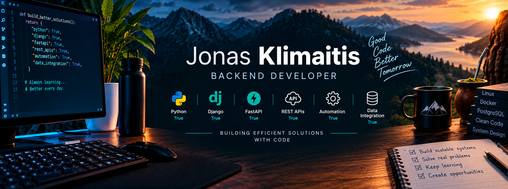

  

<h1 align="center">👋 Hi, I'm Jonas!</h1>

  Backend Developer focused on Python, Django, FastAPI, REST APIs and automation.

🌱 Currently improving my skills in Django, FastAPI, REST APIs,
SQL, Linux and automation.

🎓 Postgraduate student in Software Engineering.

### 🛠️ Technologies

  

### 🚀 About me

I'm interested in backend development, automation, APIs and
data integration. I enjoy learning by building projects and
solving real-world problems.

### 📫 Connect with me

